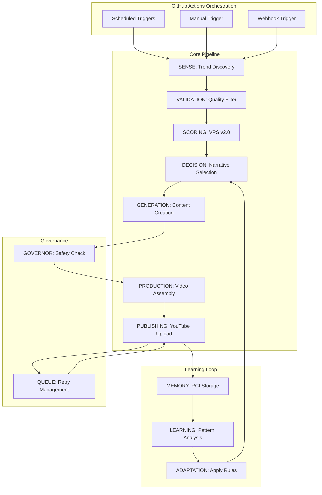
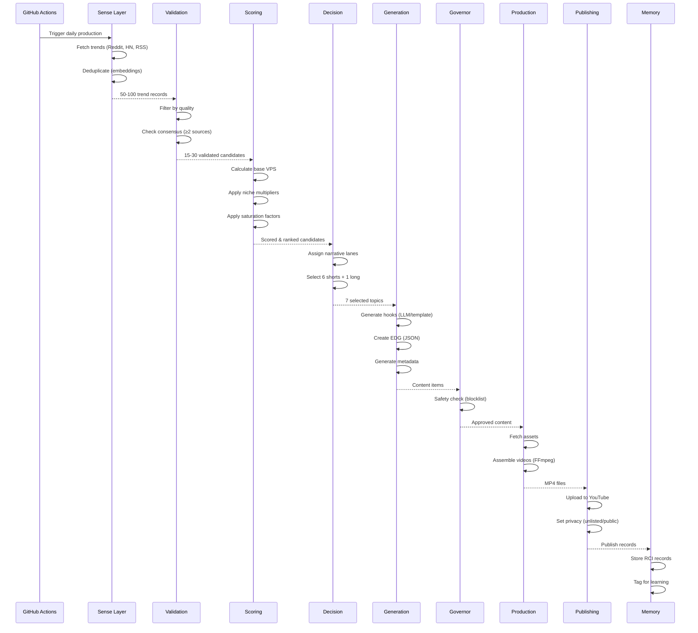
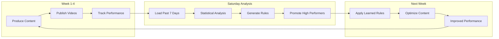

# VIRALOS PRIME v2.0 - System Diagrams

## High-Level Architecture



## Data Flow Pipeline



## Weekly Learning Cycle



## VPS Scoring Formula

```
┌─────────────────────────────────────────────────────────┐
│                   VPS v2.0 Scoring                      │
└─────────────────────────────────────────────────────────┘

Base VPS (0-100) = Σ(Component × Weight)

Components:
┌──────────────────────────┬────────┐
│ Emotional Charge         │ × 0.15 │
│ Curiosity Gap            │ × 0.20 │
│ Timeliness              │ × 0.10 │
│ Shareability            │ × 0.15 │
│ Simplicity              │ × 0.10 │
│ Historical Pattern      │ × 0.10 │
│ Narrative Continuity    │ × 0.15 │
└──────────────────────────┴────────┘

Niche Multipliers:
┌──────────────────┬────────┐
│ Finance          │ × 1.8  │
│ AI/Tech          │ × 1.6  │
│ Business         │ × 1.4  │
│ Self-Improvement │ × 1.2  │
│ Crypto           │ × 1.3  │
│ Geopolitics      │ × 1.1  │
│ News             │ × 0.4  │
│ Entertainment    │ × 0.2  │
└──────────────────┴────────┘

Saturation Factors:
┌────────────────────┬─────────┐
│ 0-2 competitors    │ × 1.8   │
│ 3-5 competitors    │ × 1.0   │
│ 6-15 competitors   │ × 0.7   │
│ 16-50 competitors  │ × 0.3   │
│ 50+ competitors    │ SKIP    │
└────────────────────┴─────────┘

Final Score = Base VPS × Niche × Saturation
```

## Publishing Schedule

```
Daily Schedule (UTC):
┌──────┬──────────┬─────────────────────────┐
│ Time │ Format   │ Reason                  │
├──────┼──────────┼─────────────────────────┤
│ 13:00│ Short    │ Early afternoon ET peak │
│ 14:00│ Long     │ Peak afternoon ET       │
│ 15:00│ Short    │ Mid-afternoon engage    │
│ 17:00│ Short    │ Evening commute start   │
│ 21:00│ Short    │ Prime time evening      │
│ 23:00│ Short    │ Late night browsing     │
│ 02:00│ Short    │ Night owl + intl        │
└──────┴──────────┴─────────────────────────┘

Daily Output:
┌──────────────────────┬───────┐
│ Shorts (9:16)        │ 6     │
│ Long-form (16:9)     │ 1     │
│ Total videos/day     │ 7     │
│ Total videos/week    │ 49    │
│ Total videos/month   │ ~210  │
└──────────────────────┴───────┘
```

## Memory & Learning

```
RCI Record Structure:
┌──────────────────────────────────────────┐
│ Video Performance Data                   │
├──────────────────────────────────────────┤
│ • Video ID & Title                       │
│ • Hook & Thumbnail Style                 │
│ • Publishing Time & Day                  │
│ • Early Signals (2h, 24h, 72h)          │
│ • Niche & Narrative Lane                 │
│ • VPS Score & Final Score                │
└──────────────────────────────────────────┘
                ↓
┌──────────────────────────────────────────┐
│ Weekly Analysis (Saturday)               │
├──────────────────────────────────────────┤
│ • Load past 7 days                       │
│ • Statistical tests (t-test, Mann-W)    │
│ • Calculate effect sizes                 │
│ • Confidence intervals                   │
└──────────────────────────────────────────┘
                ↓
┌──────────────────────────────────────────┐
│ Rule Promotion Criteria                  │
├──────────────────────────────────────────┤
│ • N ≥ 10 samples                         │
│ • Effect size ≥ 0.5 (Cohen's d)         │
│ • p-value < 0.05                         │
│ • 95% CI doesn't cross zero              │
└──────────────────────────────────────────┘
                ↓
┌──────────────────────────────────────────┐
│ Learned Rules Applied                    │
├──────────────────────────────────────────┤
│ • Thumbnail styles                       │
│ • Publishing times                       │
│ • Hook patterns                          │
│ • Format preferences                     │
│ • Niche-specific optimizations          │
└──────────────────────────────────────────┘
```

## Safety Governance Flow

```
┌─────────────────────┐
│ Generated Content   │
└──────────┬──────────┘
           │
           ▼
┌─────────────────────┐
│ Pre-Publish Scan    │
├─────────────────────┤
│ • Title             │
│ • Description       │
│ • Script/EDG        │
│ • Captions          │
└──────────┬──────────┘
           │
    ┌──────┴──────┐
    │             │
    ▼             ▼
┌────────┐   ┌────────────┐
│ Hard   │   │ Soft       │
│ Block  │   │ Block      │
└───┬────┘   └─────┬──────┘
    │              │
    ▼              ▼
┌────────┐   ┌────────────┐
│SUPPRESS│   │ADD SOURCE  │
└────────┘   │ATTRIBUTION │
             └─────┬──────┘
                   │
                   ▼
             ┌────────────┐
             │  APPROVE   │
             └────────────┘
                   │
                   ▼
             ┌────────────┐
             │  PUBLISH   │
             └────────────┘
```

## Resource Allocation

```
GitHub Actions Job Timeline (105 minutes):
┌─────────────────────────────────────────────────────────────┐
│ 0        20       40       60       80      100      105 min│
├─────────────────────────────────────────────────────────────┤
│ SENSE ████                                                   │
│ VALID   ███                                                  │
│ SCORE     ███                                                │
│ DECIDE      ██                                               │
│ GENERATE      ███████████                                    │
│ SAFETY                 ██                                    │
│ PRODUCE                  ████████████████████████████        │
│ PUBLISH                                              ██████  │
└─────────────────────────────────────────────────────────────┘

Parallelism:
┌────────────────────────────────────────┐
│ Short 1 ████████████                   │
│ Short 2 ████████████                   │
│ Short 3 ████████████    ← Parallel    │
│ Short 4 ████████████                   │
│ Short 5 ████████████                   │
│ Short 6 ████████████                   │
│ Long 1  ██████████████████  ← Longer   │
└────────────────────────────────────────┘

Memory Usage:
┌─────────────────────────────────────────┐
│ 0 GB  1 GB  2 GB  3 GB  4 GB  4.5 GB   │
├─────────────────────────────────────────┤
│ ■■■■■■■■■■■■■■■■                        │
│ ↑                          ↑            │
│ Typical                    Limit        │
└─────────────────────────────────────────┘
```

## Cost Breakdown

```
Monthly Costs (Target: <$50):
┌────────────────────────────┬──────────┐
│ GitHub Actions             │  FREE    │
│ (2000 min/month free tier) │          │
├────────────────────────────┼──────────┤
│ OpenRouter API             │  $0.63   │
│ (7 calls/day × $0.003)     │          │
├────────────────────────────┼──────────┤
│ YouTube API                │  FREE    │
│ (10k quota/day)            │          │
├────────────────────────────┼──────────┤
│ Storage (<10 GB)           │  FREE    │
├────────────────────────────┼──────────┤
│ TOTAL                      │  $0.63   │
└────────────────────────────┴──────────┘

Headroom: $49.37 for scaling
```
